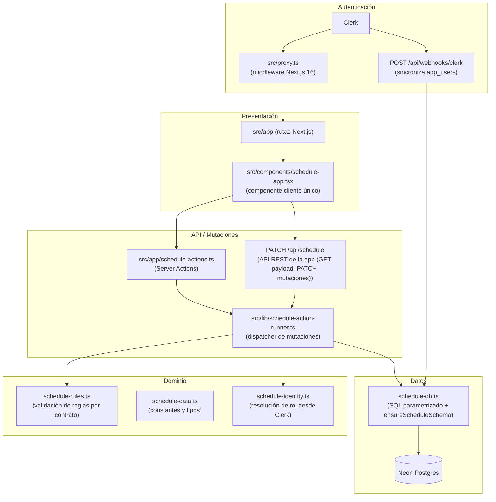

# Arquitectura

## Visión

Horarios UNMSM es un sistema de registro de disponibilidad docente para la Facultad de Ingeniería de Sistemas e Informática (FISI) de la UNMSM. Permite a cada docente declarar sus franjas horarias y los cursos que puede dictar, valida automáticamente las reglas por tipo de contrato y habilita a la Dirección para revisar, observar y aprobar cada perfil antes del cierre del período académico.

## Principios

- **Extensibilidad sobre escalabilidad**: la carga esperada es la comunidad FISI, no decenas de miles de usuarios concurrentes. Las decisiones de diseño priorizan facilidad de modificación y legibilidad del código.
- **Separación lógica de capas en un solo repositorio**: la interfaz de usuario, la lógica de dominio y el acceso a datos viven en el mismo repositorio pero en módulos claramente delimitados. El límite entre capas se mantiene por convención, no por infraestructura distribuida.
- **Dominio testeable sin framework**: `src/lib/schedule-rules.ts` y `src/lib/schedule-data.ts` no dependen de Next.js, Clerk ni Neon. Sus funciones son puras y tienen cobertura de tests que corren sin levantar el servidor.

## Capas



## Flujo de autenticación y roles

Clerk actúa como proveedor de identidad. El rol efectivo de cada usuario vive en `public_metadata.role` dentro de Clerk y se refleja en la columna `role` de `app_users`.

Los tres roles y sus permisos:

| Rol | Puede hacer |
|---|---|
| `docente` | Registrar su propia disponibilidad y cursos, enviar su perfil para revisión |
| `direccion` | Ver todos los perfiles docentes, aprobarlos, observarlos y cerrar/reabrir el período |
| `admin` | Todo lo de `direccion` más gestión de usuarios, escuelas, catálogo de cursos y auditoría |

El webhook `POST /api/webhooks/clerk` (verificado con svix) recibe los eventos `user.created` y `user.updated`. Por cada evento, sincroniza el usuario en `app_users` leyendo `public_metadata.role`. Si el campo no existe o tiene un valor inválido, el rol queda como `docente` por defecto.

Para promover usuarios a `admin` desde la línea de comandos:

```bash
bun run clerk:set-admins -- --admin-email correo@unmsm.edu.pe
```

El script `scripts/set-admin-users.ts` actualiza el `public_metadata.role` en Clerk. El webhook propaga el cambio a `app_users` en el siguiente evento de Clerk, o bien el administrador puede forzar una sincronización manual.

## Decisiones de diseño

Resumidas aquí; detalle en cada ADR:

- **Next.js full-stack** (`docs/adr/0001-nextjs-fullstack.md`): un repositorio, ciclo de retroalimentación corto, Server Components; se descartó un backend Spring Boot separado porque la necesidad era extensibilidad, no escala horizontal.
- **Postgres con SQL directo** (`docs/adr/0002-postgres-raw-sql.md`): Neon Postgres con `@neondatabase/serverless` y SQL parametrizado; sin ORM para mantener el SQL transparente y didáctico.
- **Roles en Clerk** (`docs/adr/0003-clerk-roles.md`): Clerk como proveedor de identidad, roles en `public_metadata.role` reflejados en `app_users` vía webhook.

## Operacion

```bash
bun run check
```

Ejecuta Biome (lint y formato), los tests de reglas horarias y el build de producción. Requiere variables de entorno; en CI se usan valores de marcador de posición:

```bash
export NEXT_PUBLIC_CLERK_PUBLISHABLE_KEY=pk_test_ci
export CLERK_SECRET_KEY=sk_test_ci
export DIRECTION_ACCESS_CODE=ci-direction-code
export DIRECTION_EMAIL_ALLOWLIST=direccion@unmsm.edu.pe
bun run check
```

```bash
bun run smoke https://horarios-unmsm.vercel.app
```

Valida rutas protegidas y estado de autenticación del despliegue.

```bash
bun run ops:verify
```

Verificación operacional contra producción: revisa rutas públicas, variables de entorno críticas, esquema, conteos de Neon e invariantes de disponibilidad y cupos. Ver README para el comando completo con sus parámetros.

El endpoint `/api/health` devuelve un JSON con el estado del sistema y no requiere autenticación.

## Convención de rutas

Las rutas públicas de la aplicación están en español (`/docente`, `/direccion`, `/onboarding`) porque el público es la comunidad FISI, hispanohablante. Todos los identificadores de código, nombres de archivos y carpetas están en inglés. Esta es una decisión deliberada, no una inconsistencia: el idioma de la URL refleja al usuario final; el idioma del código refleja al desarrollador.

## Uso como plantilla

Este repositorio está diseñado para ser replicable en futuros proyectos de facultad. Lo que se mantiene al clonar:

- La estructura de capas (presentación / API / dominio / datos).
- La configuración de Biome, Bun y Tailwind CSS 4.
- El cableado de autenticación con Clerk (middleware, webhook, roles en metadata).
- El pipeline de CI (`bun run check`).

Lo que se reemplaza según el dominio del nuevo proyecto:

- Los módulos de dominio (`schedule-rules.ts`, `schedule-data.ts`).
- El esquema de base de datos (`ensureScheduleSchema` en `schedule-db.ts`).
- Las semillas de datos (`scripts/seed-courses.ts`).
- Los componentes de interfaz (`src/components/schedule-app.tsx`).
