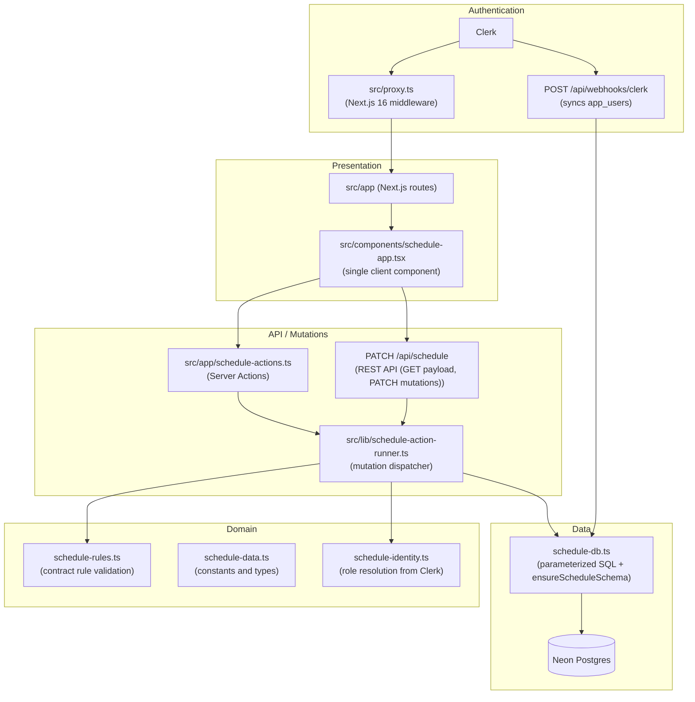

# Architecture

## Overview

Horarios UNMSM is a teacher availability registration system for the Faculty of Systems Engineering and Computer Science (FISI) at UNMSM. It lets each teacher declare their time slots and the courses they can teach, automatically validates rules by contract type, and enables the Direction office to review, flag, and approve each profile before the academic period closes.

## Principles

- **Extensibility over scalability**: the expected load is the FISI community, not tens of thousands of concurrent users. Design decisions prioritize ease of modification and code readability.
- **Logical layer separation in a single repository**: the UI, domain logic, and data access live in the same repository but in clearly bounded modules. The layer boundary is maintained by convention, not by distributed infrastructure.
- **Testable domain without a framework**: `src/lib/schedule-rules.ts` and `src/lib/schedule-data.ts` have no dependency on Next.js, Clerk, or Neon. Their functions are pure and have test coverage that runs without starting the server.

## Layers



## Authentication and role flow

Clerk acts as the identity provider. Each user's effective role lives in `public_metadata.role` inside Clerk and is mirrored in the `role` column of `app_users`.

The three roles and their permissions:

| Role | Can do |
|---|---|
| `docente` | Register their own availability and courses, submit their profile for review |
| `direccion` | View all teacher profiles, approve them, flag them, and close/reopen the period |
| `admin` | Everything `direccion` can do, plus user management, schools, course catalog, and audit |

The webhook `POST /api/webhooks/clerk` (verified with svix) receives `user.created` and `user.updated` events. For each event it syncs the user into `app_users` by reading `public_metadata.role`. If the field is absent or has an invalid value, the role defaults to `docente`.

To promote users to `admin` from the command line:

```bash
bun run clerk:set-admins -- --admin-email correo@unmsm.edu.pe
```

The script `scripts/set-admin-users.ts` updates `public_metadata.role` in Clerk. The webhook propagates the change to `app_users` on the next Clerk event, or the administrator can force a manual sync.

## Design decisions

Summarized here; details in each ADR:

- **Next.js full-stack** (`docs/adr/0001-nextjs-fullstack.md`): one repository, short feedback loop, Server Components; a separate Spring Boot backend was ruled out because the need was extensibility, not horizontal scale.
- **Postgres with raw SQL** (`docs/adr/0002-postgres-raw-sql.md`): Neon Postgres with `@neondatabase/serverless` and parameterized SQL; no ORM to keep SQL transparent and didactic.
- **Roles in Clerk** (`docs/adr/0003-clerk-roles.md`): Clerk as identity provider, roles in `public_metadata.role` mirrored in `app_users` via webhook.

## Operations

```bash
bun run check
```

Runs Biome (lint and format), schedule-rule tests, and a production build. Requires environment variables; in CI placeholder values are used:

```bash
export NEXT_PUBLIC_CLERK_PUBLISHABLE_KEY=pk_test_ci
export CLERK_SECRET_KEY=sk_test_ci
export DIRECTION_ACCESS_CODE=ci-direction-code
export DIRECTION_EMAIL_ALLOWLIST=direccion@unmsm.edu.pe
bun run check
```

```bash
bun run smoke https://horarios-unmsm.vercel.app
```

Validates protected routes and authentication state of the deployment.

```bash
bun run ops:verify
```

Operational verification against production: checks public routes, critical env vars, schema, Neon counts, and availability and slot invariants. See README for the full command with its parameters.

The `/api/health` endpoint returns a JSON status object and requires no authentication.

## Naming conventions

URL paths, route folders, file names, code identifiers, and documentation are in English. Persisted domain values are frozen in Spanish and must not be renamed:

- Role values stored in Clerk metadata and `app_users.role`: `docente`, `direccion`, `admin`
- Profile status values in `teacher_profiles.status` and `teacher_sandboxes.status`: `borrador`, `enviado`, `observado`, `aprobado`
- Schedule event types in `schedule_events.event_type`
- Source UI copy lives in locale dictionaries for Spanish, English, Simplified Chinese, and Traditional Chinese.

Test: does the string appear in a URL or file system path? Keep the route segment or file name in English behind the locale prefix. Does it get stored in the database or compared against stored data? Keep the persisted value in Spanish. Is it shown to the end user? Put it behind the i18n dictionary boundary.

Localized URLs use a required locale prefix (`/es`, `/en`, `/zh-CN`, `/zh-TW`). Requests without a locale, and old Spanish URLs such as `/docente` and `/direccion`, are redirected by `src/proxy.ts` to the negotiated locale plus the English route segment (for example `/es/teacher`).

## Use as a template

This repository is designed to be replicable in future faculty projects. What stays when you clone it:

- The layer structure (presentation / API / domain / data).
- The Biome, Bun, and Tailwind CSS 4 configuration.
- The Clerk authentication wiring (middleware, webhook, roles in metadata).
- The CI pipeline (`bun run check`).

What you replace for the new project's domain:

- The domain modules (`schedule-rules.ts`, `schedule-data.ts`).
- The database schema (`ensureScheduleSchema` in `schedule-db.ts`).
- The data seeds (`scripts/seed-courses.ts`).
- The UI components (`src/components/schedule-app.tsx`).
