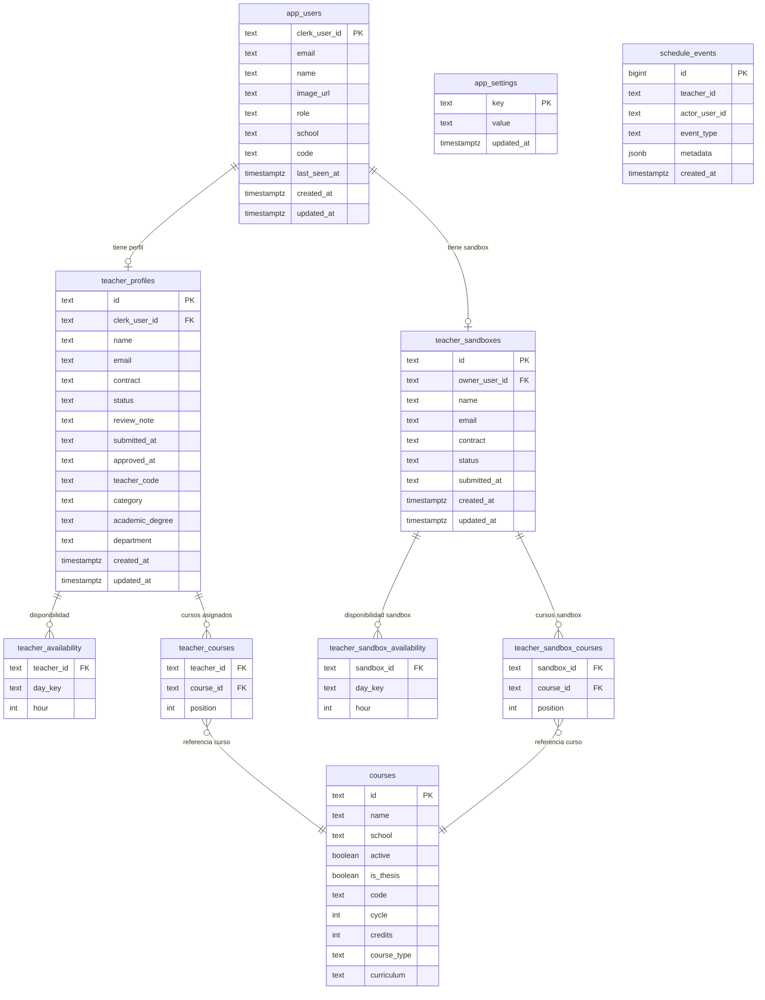

# Modelo de datos

Fuente de verdad: `src/lib/schedule-db.ts`, función `ensureScheduleSchema()`.

## Diagrama entidad-relación



## Diccionario de tablas

### app_users

Usuarios sincronizados desde Clerk vía webhook. Cada fila corresponde a un usuario autenticado.

| Columna | Tipo | Restricciones | Descripción |
|---|---|---|---|
| clerk_user_id | text | PK | Identificador de Clerk, formato `user_xxx` |
| email | text | NOT NULL | Correo principal en minúsculas |
| name | text | NOT NULL | Nombre de visualización |
| image_url | text | NOT NULL, default '' | URL de avatar de Clerk |
| role | text | NOT NULL, default 'docente', CHECK | Rol efectivo: `docente`, `direccion` o `admin` |
| school | text | NOT NULL, default 'Sin departamento' | Escuela o departamento del usuario |
| code | text | NOT NULL, default '' | Código docente institucional (opcional) |
| last_seen_at | timestamptz | nullable | Última actividad registrada |
| created_at | timestamptz | NOT NULL, default now() | Fecha de creación |
| updated_at | timestamptz | NOT NULL, default now() | Fecha de última actualización |

### teacher_profiles

Perfil de disponibilidad de cada docente. Un docente puede tener a lo sumo un perfil. El estado sigue el flujo descrito en la sección Invariantes.

| Columna | Tipo | Restricciones | Descripción |
|---|---|---|---|
| id | text | PK | Identificador interno del perfil |
| clerk_user_id | text | UNIQUE, FK -> app_users, ON DELETE SET NULL | Vínculo con el usuario Clerk |
| name | text | NOT NULL | Nombre del docente |
| email | text | NOT NULL | Correo del docente |
| contract | text | NOT NULL, CHECK | Tipo de contrato: `full`, `partial20`, `partial10` |
| status | text | NOT NULL, default 'borrador', CHECK | Estado del perfil (ver Invariantes) |
| review_note | text | NOT NULL, default '' | Observación administrativa cuando status='observado' |
| submitted_at | text | nullable | Fecha ISO 8601 de envío |
| approved_at | text | nullable | Fecha ISO 8601 de aprobación |
| teacher_code | text | nullable | Código institucional del docente |
| category | text | nullable | Categoría docente |
| academic_degree | text | nullable | Grado académico |
| department | text | nullable | Departamento académico |
| created_at | timestamptz | NOT NULL, default now() | Fecha de creación |
| updated_at | timestamptz | NOT NULL, default now() | Fecha de última actualización |

### courses

Catálogo de cursos que puede dictar un docente. Administrado por el rol `admin`.

| Columna | Tipo | Restricciones | Descripción |
|---|---|---|---|
| id | text | PK | Identificador del curso |
| name | text | NOT NULL | Nombre del curso |
| school | text | NOT NULL | Escuela a la que pertenece |
| active | boolean | NOT NULL, default true | Si el curso aparece en el catálogo activo |
| is_thesis | boolean | NOT NULL, default false | Marca cursos de tesis (no cuentan para el límite de cursos) |
| code | text | nullable | Código de plan de estudios |
| cycle | int | nullable | Ciclo académico |
| credits | int | nullable | Créditos del curso |
| course_type | text | nullable | Tipo de curso |
| curriculum | text | nullable | Plan de estudios al que pertenece |

### teacher_availability

Franjas horarias registradas por un docente. Cada fila representa una hora disponible en un día.

| Columna | Tipo | Restricciones | Descripción |
|---|---|---|---|
| teacher_id | text | PK (compuesto), FK -> teacher_profiles, ON DELETE CASCADE | Perfil docente |
| day_key | text | PK (compuesto) | Día de la semana: `lunes`, `martes`, `miercoles`, `jueves`, `viernes`, `sabado` |
| hour | int | PK (compuesto) | Hora en formato 8-21 |

### teacher_courses

Cursos asignados a un docente en un perfil. No se puede eliminar un curso si tiene asignaciones activas.

| Columna | Tipo | Restricciones | Descripción |
|---|---|---|---|
| teacher_id | text | PK (compuesto), FK -> teacher_profiles, ON DELETE CASCADE | Perfil docente |
| course_id | text | PK (compuesto), FK -> courses, ON DELETE RESTRICT | Curso del catálogo |
| position | int | NOT NULL, default 0 | Orden de visualización |

### app_settings

Parámetros de configuración global del sistema en formato clave-valor.

| Columna | Tipo | Restricciones | Descripción |
|---|---|---|---|
| key | text | PK | Nombre del parámetro (ej. `academic_term`, `period_closed`) |
| value | text | NOT NULL | Valor serializado como texto |
| updated_at | timestamptz | NOT NULL, default now() | Fecha de última actualización |

### schedule_events

Registro de auditoría de eventos relevantes (envíos, aprobaciones, observaciones, cierres de período).

| Columna | Tipo | Restricciones | Descripción |
|---|---|---|---|
| id | bigint | PK, secuencia automática | Identificador secuencial |
| teacher_id | text | NOT NULL | Perfil docente afectado (sin FK para preservar historial tras borrado) |
| actor_user_id | text | NOT NULL | Usuario que realizó la acción |
| event_type | text | NOT NULL | Tipo de evento (ej. `submit`, `approve`, `observe`) |
| metadata | jsonb | NOT NULL, default '{}' | Datos adicionales del evento |
| created_at | timestamptz | NOT NULL, default now() | Fecha del evento |

### teacher_sandboxes

Perfil de prueba que permite a un usuario de `direccion` o `admin` simular el flujo de un docente sin crear un perfil real.

| Columna | Tipo | Restricciones | Descripción |
|---|---|---|---|
| id | text | PK | Identificador del sandbox |
| owner_user_id | text | UNIQUE, FK -> app_users, ON DELETE CASCADE | Usuario propietario del sandbox |
| name | text | NOT NULL | Nombre para el sandbox |
| email | text | NOT NULL | Correo para el sandbox |
| contract | text | NOT NULL, CHECK | Tipo de contrato simulado |
| status | text | NOT NULL, default 'borrador', CHECK | Estado del sandbox (mismos valores que teacher_profiles) |
| submitted_at | text | nullable | Fecha ISO 8601 de envío simulado |
| created_at | timestamptz | NOT NULL, default now() | Fecha de creación |
| updated_at | timestamptz | NOT NULL, default now() | Fecha de última actualización |

### teacher_sandbox_availability

Franjas horarias del sandbox. Estructura idéntica a `teacher_availability`.

| Columna | Tipo | Restricciones | Descripción |
|---|---|---|---|
| sandbox_id | text | PK (compuesto), FK -> teacher_sandboxes, ON DELETE CASCADE | Sandbox padre |
| day_key | text | PK (compuesto) | Día de la semana |
| hour | int | PK (compuesto) | Hora en formato 8-21 |

### teacher_sandbox_courses

Cursos del sandbox. Estructura idéntica a `teacher_courses`.

| Columna | Tipo | Restricciones | Descripción |
|---|---|---|---|
| sandbox_id | text | PK (compuesto), FK -> teacher_sandboxes, ON DELETE CASCADE | Sandbox padre |
| course_id | text | PK (compuesto), FK -> courses, ON DELETE RESTRICT | Curso del catálogo |
| position | int | NOT NULL, default 0 | Orden de visualización |

## Invariantes

### Flujo de estado de teacher_profiles

El campo `status` sigue el siguiente ciclo de vida:

```
borrador --> enviado --> aprobado
    ^            |
    |            v
    +------- observado
```

- `borrador`: el docente aún no ha enviado su disponibilidad.
- `enviado`: el docente envió y espera revisión administrativa.
- `observado`: Dirección devolvió el perfil con una nota en `review_note`.
- `aprobado`: Dirección aprobó el horario.

Cuando un perfil pasa a `observado`, `review_note` contiene la observación escrita por Dirección. Al reenviarlo, `review_note` se limpia.

### Reglas por tipo de contrato

Definidas en `src/lib/schedule-rules.ts` y `src/lib/schedule-data.ts`.

| Tipo | Clave | Horas totales | Horas diarias | Bloques de 4h por dia | Dias con bloque | Max cursos (sin tesis) |
|---|---|---|---|---|---|---|
| Tiempo completo | `full` | 40 | 8 | 2 | 5 | 3 |
| Tiempo parcial 20 h | `partial20` | 20 | 4 | 1 | 5 | 2 |
| Tiempo parcial 10 h | `partial10` | 12 | 4 | 1 | 3 | 1 |

Los cursos marcados con `is_thesis = true` no cuentan para el límite de cursos por contrato.

### Compuerta de período abierto

Toda mutación de datos docentes llama internamente a `ensurePeriodOpen()`, que lee `app_settings.period_closed`. Si el valor es `'true'`, la operación falla con HTTP 403. El campo `period_closed_at` registra el instante de cierre. Dirección o Admin pueden reabrir el período desde la pantalla de configuración.
